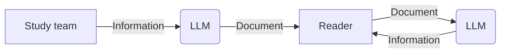
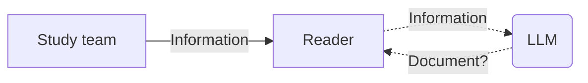



A lot of what we read, see and hear nowadays has been generated by LLMs, and people notice it. I recently stumbled upon [AI;DR](https://aididntread.net/) (*AI; didn't read!*), which is a concise way of saying you refused to read something because it was not written by a human.

This kind of backlash is not limited to plain text. Quite a few open-source maintainers lament the avalanche of AI-generated PRs they receive and the burden that is placed upon them since they have to review each one carefully. Some have even adopted blanket policies banning all AI-generated contributions.

I want to argue that for a lot of writing, the interesting question isn’t who writes it, but whether it needs to be written at all.

### Is AI-generated writing worse?

I don't find it easy to articulate a reason why AI-generated *things* are worse than human-generated ones. Of course, the quality of the work is a huge factor, but having seen the evolution of models over the past few years, one can only assume the quality gap between AI-generated and human-generated content will soon close, if it is not already closed.

And we also have to remember that there are plenty of humans who produce content with varying levels of care and competence. Taking "human-generated" to mean "what the best human can produce at the peak of their abilities" is a bit disingenuous. The website for [AI;DR](https://aididntread.net/) explains its position as follows:

> Writing is one of the few things that still forces real thinking. You start with a vague feeling or half-formed idea. You wrestle with it. You throw words on the page, hate most of them, rearrange, delete, add, and eventually something clear and honest emerges. That process isn't optional. It's how the thinking happens.

I have read many texts, not only in some comment section but also written by professional writers, that were so full of errors, biases, and poor style that I cannot really believe rejecting AI content would meaningfully increase the quality of thinking I am exposed to.

The authors of [aidr.ch](https://aidr.ch/), a technology journal whose articles are themselves generated by LLMs, have also argued that although the text might be generated by an LLM, the act of publishing that text is still done by a human:

> What remains human is the act of publication. The editor decides what is released and assumes responsibility for its content and consequences.

### Review burden and responsibility

When it comes to source code, the issue of reviewing and maintaining contributions was present long before LLMs (*Long* is relative. In this day and age, 5 years ago might as well be pre-history). [SQLite](https://sqlite.org/index.html) authors seldom accept contributions, if at all, and [openly](https://sqlite.org/copyright.html) discourage contributions from "random people on the internet", even if those patches are 100% hand-written. The AI debate is a new instance of an old one about review burden and responsibility.

On the other end of the spectrum, Linus Torvalds [defends](https://lore.kernel.org/linux-media/CAHk-=wi4zC+Ze8e+p3tMv8TtG_80KzsZ1syL9anBtmEh5Z40vg@mail.gmail.com/) the use of AI tools for contributing to the Linux kernel:

> AI is a tool, just like other tools we use.  And it's clearly a useful one.
> It may not have been that "clearly" even just a year ago, but it's no longer in question today.

This is a very pragmatic point of view. So much so that I have to wonder, why doesn't everyone subscribe to it? Are LLMs actually preventing us from thinking properly because we don't write?

I would argue that writing-as-thinking matters for writing where thinking is the point, and for many use cases, that is not the case.

### Writing in clinical studies

I was inspired to write this post because of [a recent paper in *Clinical Trials* on LLM-authored statistical analysis plans](https://doi.org/10.1177/17407745261422365). In it, and in other papers by the same team, the authors present their work on using LLMs to automate writing documents in a clinical study context.

Clinical studies are, for very good reasons, notoriously hard and expensive. You not only have to do a lot of things right, but you also have to show that you are doing them right. This means writing many documents, e.g. to explain that you have thought about the safety of participants, and how you are planning to analyse the data you will gather.

There are entire departments in pharmaceutical companies dedicated to writing these documents. For large companies running large studies, the flow looks something like this:

**Today: a human writes the document**

These documents' main purpose is to *convey information*. There is virtually no creativity involved, and they follow a pretty well-established format. This is not unlike scientific papers, which largely follow a known structure:
- An introduction where the problem at hand is explained, along with how others have tackled the problem
- A methods section where the authors explain what they actually did
- Results, usually containing figures
- A discussion section where the results are summarized and put in perspective

Seasoned researchers do not read papers in that order. They basically ignore most of the paper, and focus on the figures, the methods, and maybe the discussion. In fact, learning how to read scientific papers is one of the first tasks for aspiring researchers.

I assume readers of regulatory documents work the same way. They don't read dozens of statistical analysis plans word-by-word. Rather, the known structure allows them to quickly skim through and focus on the actual information inside, e.g. sample size, significance tests.

Because the authors of the linked paper are interested in running innovative, and therefore risky, studies, they sometimes don't have access to dedicated experts for writing these documents, even if they are working in large pharmaceutical companies. This is the gap they are trying to fill. And their approach is basically to use an LLM to generate the document from the actual information.

**What the paper proposes: an LLM writes the document**

### Readers use LLMs too

I don't think there is anything wrong with this approach, and it even got me wondering: don't the readers use LLMs too? Maybe faced with a myriad of documents, they have set up a system to quickly find the information they are interested in. It is not far-fetched to imagine that this is what actually happens:

**What probably already happens: an LLM writes it and another LLM reads it**

### Skipping the document

But do we even need the document? Presumably, we could imagine this flow:

**Where this ends: nobody writes**

In plain words, the study team just sends the information to the intended reader, and the reader either consumes that information directly or, more likely, asks their own LLM to generate a document.

This makes even more sense if we imagine that the information we want to transmit isn't neatly organised in a single document, but is instead scattered among a bunch of documents that would be trivial for an LLM to parse, albeit very annoying for a human.

One could object that the statistical analysis plan is not only a way of conveying information, it is also a binding record. A document that your LLM generates on demand does not bind another person.

But the responsibility was never in the prose. It is in the act of "publishing". If the study team signs the information it sends, then the document a reader generates is merely a view of a signed record, rather than the record itself.

This is less speculative than it sounds. CDISC and TransCelerate have been working on [Digital Data Flow](https://www.cdisc.org/ddf) since 2021: a model of the study definition that systems exchange directly, with the protocol document as one of several renderings of it. The canonical object is already moving from the document to the information behind it.

Writing is a multi-faceted activity, and creativity is not always part of it. Will there always be writers? I think so. But they will focus on writing things where they can have the freedom to express themselves however they like.

Then there are the other documents: technical, regulatory, scientific. Creativity there is not only not necessary but even frowned upon. Would you actually like to have a creative safety notice?

For those, the trend might not even be towards "LLMs writing", but "Not writing anything".

